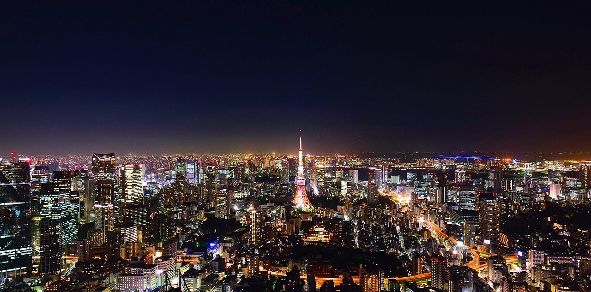

# TIL 5일차(20231219) - 그럴듯한 시멘틱 구조 웹 페이지 만들기 2편

이번 편에서는 main 요소와 footer 요소를 완성시켜 보겠습니다.


## main 요소

main 요소는 아래와 같이 thumbnail 섹션과 highlights 섹션으로 나뉘어 있습니다.

우선 썸네일 섹션부터 만들어 보아요~! 😀  


### 썸네일 섹션 만들기


*index.html*
```html  
<!doctype html>  <html lang="en">  
...  
<main>  
    <section id="thumbnail">        <div id="thumbnail-card">    
            <p class="section-title">Jason's Travel Page</p>    
            <p style="font-size: 36px;">Let's explore the world together!</p>    
            <a>Discover places</a>    
        </div>  
    </section></main>  
...  
</html>  
```  

*styles.css*
```css  
section p {    text-transform: uppercase;    
margin: 0  }    
    
.section-title {    font-size: 46px;    
font-weight: 700  }    
    
#thumbnail {    
    height: 800px;    
    background-image: url(/images/main-background.jpg);    
    background-size: cover;    
    background-position: center;    
    display: flex;    
    justify-content: center;    
    align-items: center;  
}    
    
#highlights, #thumbnail-card {    
    padding: 30px;    
    flex-direction: column;  
}    
    
#thumbnail-card {    
    display: flex;    
    margin-top: 100px;    
    justify-content: center;    
    align-items: center;    
    row-gap: 30px;    
    width: 70%;    
    height: 50%;    
    background-color: rgba(0, 0, 0, .6);    
    border-radius: 20px;    
    color: #ffffff;    
text-align: center  }    
    
#thumbnail-card a {    padding: 30px 50px;    
    background-color: #ffffff;    
    border-radius: 20px;    
    color: #000000;    
    font-size: 24px;    
    font-weight: 700;  
}  
```  

### 하이라이트 섹션 만들기


*index.html*
```html  
<!doctype html>  <html lang="en">  ...  
<body>  ...  
<main>    
    <section id="thumbnail">    
        ...  
    </section>    <section id="highlights">        <p class="section-title" style="color: #ffffff">Highlights</p>    
        <div class="highlights-places-wrapper">    
            <div class="highlights-places">    
                    
                <p>Helsinki, <span>Finland</span></p>    
            </div>  
            <div class="highlights-places">                    
                <p>Tokyo, <span>Japan</span></p>    
            </div>  
          <div class="highlights-places">                    
                <p>Moscow, Russia</p>    
            </div>  
       </div>    </section></main>  ...  
</body>  </html>  
```  

*styles.css*
```css  
...  
  
#highlights {    
    height: 500px;    
    row-gap: 50px;    
background: linear-gradient(to right, #d7dff2, #cdd9f3, #c4d1f1);  }    
    
#highlights, .highlights-places, .highlights-places-wrapper {    
    display: flex;    
    justify-content: center;    
align-items: center;  }    
    
.highlights-places-wrapper {    
column-gap: 40px;  }    
    
.highlights-places {    
    width: 30%;    
    height: 100%;    
    flex-direction: column;    
    row-gap: 20px;    
    font-size: 24px;    
    font-weight: 500;    
text-align: center;  }    
    
.highlights-places img {    
    object-fit: cover;    
    width: 100%;    
    height: 100%;    
    border-radius: 20px;    
box-shadow: 2px 3px 15px rgba(0, 0, 0, 0.6);  }  
  
```  

### styles.css와 shared.css
앞선 [TIL 4일차(20231218) - 그럴듯한 시멘틱 구조 웹 페이지 만들기 1편](https://velog.io/@intellik/TIL-4%EC%9D%BC%EC%B0%A820231218-%EA%B7%B8%EB%9F%B4%EB%93%AF%ED%95%9C-%EC%8B%9C%EB%A9%98%ED%8B%B1-%EA%B5%AC%EC%A1%B0-%EC%9B%B9-%ED%8E%98%EC%9D%B4%EC%A7%80-%EB%A7%8C%EB%93%A4%EA%B8%B0-1%ED%8E%B8) 에서는 코드를 shared.css에 저장했는데, main 요소의 코드는 styles.css 에 저장했습니다.

그 이유는! shared.css는 여러 페이지가 공통으로 사용할 header와 footer에 사용될 스타일시트이고, main 요소는 페이지마다 바뀔 예정이기 때문이죠!

## footer 요소


footer에는 인스타그램, 페이스북 아이콘에 단순히 인스타그램과 페이스북 링크를 연결했습니다.

footer는 따로 position을 absolute로 두지 않았는데, 그 이유는 footer에 겹쳐질 '사진'이 없기 때문에 포지션을 absolute로 둘 필요성을 느끼지 못했기 때문입니다.

일반적인 웹 사이트의 경우 최하단 컨텐츠의 경우 main 요소와 좀 격리된? 스타일로 아래처럼 구성하기도 하구요!


그래서, footer는 border-top 속성을 이용해 main 요소와 구분감만 주고 position은 디폴트 값(static)으로 두었습니다.

*index.html*
```html
<!doctype html>  
<html lang="en">
...
<body>
	...
<footer>  
    <div>
		<a href="https://www.instagram.com/">  
              
        </a>
	</div>
	<div>
		<a href="https://www.facebook.com/">  
              
        </a>    
	</div>
</footer>
</body>  
</html>
```

*shared.css*
```css
...
footer {  
    display: flex;  
    justify-content: center;  
    padding: 30px 0;  
    align-items: center;  
    column-gap: 8%;  
    border-top: 1px solid rgba(30, 144, 255, 0.03);  
    background-color: rgba(196, 209, 241, 0.6);  
}  
  
footer div {  
    width: 8%;  
}  
  
footer img {  
    object-fit: cover;  
    width: 100%;  
    height: 100%;  
}
```

